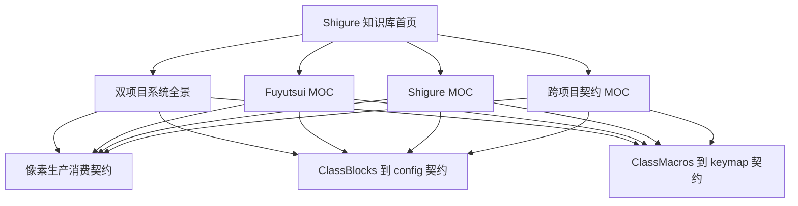

# Shigure 知识库首页

## AI 摘要

本仓库包含两个共同发布、职责独立的组件：

- **Fuyutsui** 是 WoW Retail Lua AddOn。它读取游戏 API，把状态编码为屏幕顶部像素和横向条，并创建游戏内宏及覆盖绑定。
- **Shigure** 是 Windows WinForms 程序。它截取并解码这些像素，构建 `GameState`，按模块规则选择动作，再向 WoW 窗口发送热键；仓库内 `Fuyutsui/` 是它编辑、生成配置和部署游戏插件时使用的唯一权威源。

两者仍通过像素和按键形成生产者—消费者闭环，但源码、构建和发布已整合在同一仓库。Shigure 启动时会把内置插件按 SHA-256 单向部署到目标游戏；游戏目录是运行副本，不是编辑源。开始任何修改前，先读 [[10-系统/00-Shigure-双项目系统全景|双项目系统全景]]，再沿本页的任务路由进入组件 MOC 和跨项目契约。

### 事实优先级

当文档互相冲突时，按以下顺序判断：

1. 当前工作区源码、`Fuyutsui.toc` 与 `Shigure.csproj`。
2. `status: current` 且带有最近 `verified_at` 的功能文档和跨项目契约。
3. 项目 MOC、README 与贡献约定。
4. 标记为 `version-pinned`、`needs-review` 或 `historical` 的参考和审计快照。

文档不得凌驾于源码；发现偏差时，应修正文档或降低其状态，而不是让新代码迁就过期描述。

## 范围与边界

本知识库负责解释：

- 两个组件各自拥有的数据、运行时职责、持久化文件及内置源到游戏副本的部署边界。
- 屏幕像素、`ClassBlocks → config`、`ClassMacros → keymap` 三条跨项目契约。
- 从 WoW 事件到像素、从截图到 `GameState`、从规则到热键的完整链路。
- 修改某一协议、字段或单位编号时，另一个项目必须同步检查的影响面。

本知识库不替代：

- WoW API 的官方版本文档；AuraContainer 的版本固定参考见 [[50-参考资料/AuraContainer_AI_Reference_zh-CN|AuraContainer AI 技术参考]]。
- 用户免责声明、运行与安装说明保留在仓库根 `README.md`；Fuyutsui 上游项目链接也由该文件说明。
- 游戏内实测。WoW API、安全按钮、秘密值和屏幕采样仍需在实际客户端验证。

## 输入、输出与按任务导航

本页的输入是一个待理解或待修改的问题；输出是最短且不会遗漏跨项目影响的阅读路径。

| 任务 | 首读 | 随后阅读 |
|---|---|---|
| 理解整个系统 | [[10-系统/00-Shigure-双项目系统全景|双项目系统全景]] | 两个项目 MOC |
| 修改顶部 510 格、CountBars 或治疗吸收网格 | [[40-跨项目/01-Shigure-像素生产消费契约|像素生产消费契约]] | [[50-参考资料/BLOCK_AI_Reference_zh-CN|Fuyutsui 像素实现参考]]、[[30-Shigure/02-Shigure-像素扫描与协议解码|Shigure 像素扫描]] |
| 修改职业状态、光环、法术或队伍布局 | [[40-跨项目/02-Shigure-ClassBlocks到config同步契约|ClassBlocks 到 config 契约]] | [[50-参考资料/TEXTURE_LAYOUT_zh-CN|纹理与索引布局]]、[[30-Shigure/03-Shigure-配置合并与GameState构建|GameState 构建]] |
| 修改职业宏、单位编号或热键池 | [[40-跨项目/03-Shigure-ClassMacros到keymap与按键契约|ClassMacros 到 keymap 与按键契约]] | [[50-参考资料/CLASSMACROS_AI_Reference_zh-CN|ClassMacros 规则参考]]、[[30-Shigure/08-Shigure-Keymap解析与按键发送|Shigure Keymap 与按键发送]] |
| 修改 Fuyutsui 事件或刷新频率 | [[20-Fuyutsui/02-Fuyutsui-事件与刷新调度|Fuyutsui 事件与刷新调度]] | [[30-Shigure/04-Shigure-运行循环触发模式与快照|Shigure 运行循环]] |
| 修改内置插件部署、路径或发布内容 | [[30-Shigure/09-Shigure-Fuyutsui配置宏编辑与同步|Fuyutsui 编辑与部署]] | [[30-Shigure/11-Shigure-本地数据路径构建与验证|路径、构建与验证]] |
| 修改 Shigure 模块 JSON 或规则语义 | [[30-Shigure/05-Shigure-模块存储匹配与版本迁移|模块存储与匹配]] | [[30-Shigure/06-Shigure-规则条件与特殊动作|规则条件]]、[[30-Shigure/07-Shigure-动态单位数量与公式|动态字段]] |
| 评估兼容性和发布风险 | [[40-跨项目/04-Shigure-兼容性变更检查清单|兼容性变更检查清单]] | 受影响契约页及项目功能页 |

## 阅读链路

推荐 AI 使用以下顺序建立上下文：

1. 阅读 [[00-导航/01-Shigure-AI阅读顺序与术语|AI 阅读顺序与术语]]，统一名称和编号语义。
2. 阅读 [[10-系统/00-Shigure-双项目系统全景|双项目系统全景]]，确认组件边界和端到端链路。
3. 根据任务进入 [[20-Fuyutsui/00-Fuyutsui-MOC|Fuyutsui MOC]] 或 [[30-Shigure/00-Shigure-MOC|Shigure MOC]]。
4. 只要改动跨越进程或生成文件，就进入 [[40-跨项目/00-Shigure-跨项目契约-MOC|跨项目契约 MOC]]。
5. 最后打开 frontmatter 的 `source_files` 和 `source_symbols` 核对当前实现。

不要从历史审计中的旧行号直接跳到实现；先重新搜索当前符号。

## 现有文档的职责

专项资料统一从 [[50-参考资料/00-参考资料-MOC|参考资料 MOC]] 进入；下表说明各资料的使用边界。

保留的专项文档各自只承担一种补充职责：

| 文档 | 知识库角色 | 使用限制 |
|---|---|---|
| [[50-参考资料/BLOCK_AI_Reference_zh-CN|Fuyutsui block 技术参考]] | 像素和横向条的低层实现 | 跨进程不变量以像素契约页为入口 |
| [[50-参考资料/TEXTURE_LAYOUT_zh-CN|纹理排序说明]] | `ClassBlocks` 索引分配 | 不负责 Shigure 转换和运行时消费 |
| [[50-参考资料/AuraContainer_AI_Reference_zh-CN|AuraContainer 技术参考]] | 特定 PTR 构建的外部 API 参考 | 是版本固定资料，不自动代表当前正式服 |
| [[50-参考资料/CLASSMACROS_AI_Reference_zh-CN|ClassMacros 规则参考]] | Fuyutsui 宏声明和槽位算法 | Shigure 侧消费规则见跨项目热键契约 |
| [[50-参考资料/OPTIMIZATION_zh-CN|Fuyutsui 优化建议]] | 2026-07 静态审计快照 | 旧 `main.lua` 行号已失效，不是当前事实源 |
| `CLAUDE.md`（当前开发约定） | 根级架构与开发规则 | 同时说明 Shigure、内置 Fuyutsui 与部署链路 |

项目自身说明位于 Senkoh 库外、同一仓库根目录，以普通路径引用而不创建未解析的 Obsidian 节点：`README.md`、`CLAUDE.md`。

## 关键不变量与失败模式

### 不变量

- 每篇功能页必须至少有一个 `up` 链接和一个有语义的 `related` 链接；MOC 必须覆盖所有直属功能页。
- `related` 只链接 Markdown 笔记；源码路径必须放在 `source_files`，避免生成伪知识节点。
- 跨项目共享格式只有一个契约入口，项目功能页描述本地实现，不各自发明第二份协议。
- 文档中的版本、单位编号、像素数量和字段顺序必须能追溯到当前源码或明确的版本快照。

### 已确认的失败模式

- 旧外部资料曾提到 `auracontainer.lua`；当前内置插件不存在该文件，`Fuyutsui.toc` 也不加载它，光环像素实现以 `Fuyutsui/core/block.lua` 为准。
- 当前源码与 README 均以 `ModuleDefinition.CurrentUnitMappingVersion = 4` 为准；旧模块按版本逐级迁移。
- [[50-参考资料/OPTIMIZATION_zh-CN|旧优化审计]] 引用了拆分前千行 `main.lua` 的位置；按行号实施会定位到错误文件。
- 只写普通文本文件名而不创建 Obsidian 内部笔记链接，不会形成可靠的关系边，容易产生孤立节点。

## 修改影响

新增或调整文档时：

1. 更新直属 MOC 的任务路由和链接。
2. 若改变输入、输出或不变量，更新对应跨项目契约，而不只是本地功能页。
3. 更新 `verified_at`；无法验证的结论改为 `needs-review` 或 `version-pinned`。
4. 使用 Obsidian 全局图检查孤立节点和未解析链接。
5. 若源码变化使历史文档失真，保留其历史价值并降低状态，不要无说明地覆盖审计上下文。

## 源码索引

| 入口 | 作用 |
|---|---|
| `Fuyutsui/Fuyutsui.toc` | Fuyutsui 实际加载顺序和版本元数据 |
| `Fuyutsui/core/core.lua` | AddOn 生命周期、事件分发和 SavedVariables |
| `Fuyutsui/main.lua` | `ClassBlocks`、宏和初始状态编排 |
| `App/Program.cs` | Shigure 组合根 |
| `Infrastructure/FuyutsuiAddonSyncService.cs` | 内置插件到游戏目录的 SHA-256 单向部署 |
| `Runtime/ShigureRuntime.cs` | 主运行循环 |
| `Modules/ModuleStore.cs` | 模块模型、持久化、规则执行和版本迁移 |
| `Infrastructure/FuyutsuiConfigConverter.cs` | `ClassBlocks → config` 转换 |
| `Infrastructure/FuyutsuiKeymapConverter.cs` | `ClassMacros → keymap` 转换 |

## 知识图谱

## 关系

- 下级：[[10-系统/00-Shigure-双项目系统全景|双项目系统全景]]、[[20-Fuyutsui/00-Fuyutsui-MOC|Fuyutsui MOC]]、[[30-Shigure/00-Shigure-MOC|Shigure MOC]]、[[40-跨项目/00-Shigure-跨项目契约-MOC|跨项目契约 MOC]]
- 使用说明：[[00-导航/01-Shigure-AI阅读顺序与术语|AI 阅读顺序与术语]]
