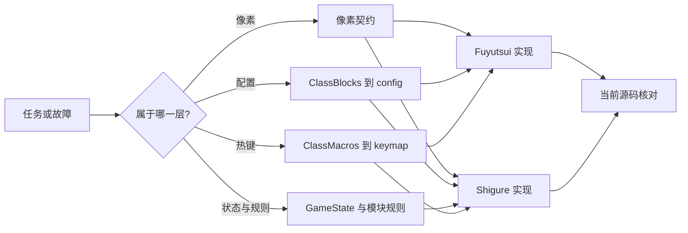

# Shigure AI 阅读顺序与术语

## AI 摘要

同一个词在两个项目中可能处于不同层次。例如，Fuyutsui 的 `blocks` 是索引映射，Shigure 的 `config` 是解码映射，`GameState` 才是规则读取的业务状态；三者不能互换。AI 应先判断问题属于“生产像素、传输协议、解码状态、规则决策、热键执行”中的哪一层，再阅读对应契约和源码。

当前源码还包含一个必须牢记的版本事实：Shigure 模块单位映射版本是 **3**。保留单位为 `0`、`31..35`；旧版把 `36/37` 当单位的记录会迁移成 `channeling/nochanneling` 宏条件。README 中曾存在的版本 2 描述已于 2026-08-09 修正。

## 范围与预期输出

本页输入是自然语言任务、报错或待修改功能，输出是：

1. 统一后的术语含义。
2. 应先阅读的契约和项目功能页。
3. 必须核对的当前源码入口。
4. 是否涉及跨项目兼容性。

它不展开各算法的全部实现；细节由链接到的功能页和源码负责。

## 核心术语

| 术语 | 当前含义 | 常见误解 |
|---|---|---|
| `Fuyutsui.ClassBlocks` | `class/*.lua` 按专精声明的 `states/auras/spells/items/group` 数据 | 不是运行时最终索引，也不是 Shigure JSON |
| `Fuyutsui.blocks` | `LoadPlayerBlocks` 根据当前专精生成的运行时索引映射 | 不是所有职业的静态配置 |
| 主色块行 | 屏幕顶部最多 510 个 RGB 编码格 | 业务字段的绝对索引并非跨专精固定 |
| CountBars | 与主色块索引独立的横向计数条，用于充能、施法次数和光环层数 | 不是主色块的第二段索引 |
| 治疗吸收网格 | CountBars 下方、最多 30 个单位的独立采样区域 | 不能按 CountBars 的段编号解码 |
| `step` | Shigure `config` 指向主色块列的编号；值为 `"bar"` 时改读条段 | `group` 内数字 `step` 是相对成员起点的偏移 |
| `config/*.json` | 从 `ClassBlocks` 生成的 Shigure 解码映射 | 不应成为绕过 Lua 源配置的第二真相源 |
| `GameState` | `StateBuilder` 把原始字节按 config 变成的业务状态 | 不包含像素位置知识，也不负责发送按键 |
| module | Shigure 的匹配条件、动态字段和有序规则 JSON | 不等于 Fuyutsui 宏 |
| `ClassMacros` | Fuyutsui 按职业声明的 dynamic/static/special 宏数据 | 不等于 Shigure 生成后的 keymap |
| keymap | Shigure 用于 `(职业、单位、技能、宏条件) → 热键` 的生成数据 | 不是 Windows 虚拟键表本身 |
| MOC | Map of Content，负责导航和关系，不重复功能页正文 | 不是又一篇完整架构说明 |
| 契约 | 两个项目必须一致理解的格式、不变量和变更责任 | 不能只在生产端修改 |

## 单位与编号

当前 Shigure 源码中的保留单位：

| 编号 | 语义 |
|---:|---|
| `0` | 无目标 |
| `1..30` | 队伍或团队槽位 |
| `31` | 玩家 |
| `32` | 当前目标 |
| `33` | 焦点 |
| `34` | 地面/光标位置 |
| `35` | 鼠标指向 |

`36/37` 不是当前保留单位。加载旧模块或 keymap 时，`MacroConditionText.NormalizeLegacyUnit` 会把它们迁移为无目标单位加 `channeling` 或 `nochanneling` 条件。当前 `ModuleDefinition.CurrentUnitMappingVersion = 3`。

## 输入、输出与阅读路由

| 输入关键词或现象 | 输出层 | 阅读顺序 |
|---|---|---|
| `510`、RGB、错位、CountBars、治疗吸收 | 像素传输 | [[40-跨项目/01-Shigure-像素生产消费契约|像素契约]] → 生产端/消费端功能页 |
| `states/auras/spells/items/group`、职业 Lua、step | 配置生成 | [[40-跨项目/02-Shigure-ClassBlocks到config同步契约|ClassBlocks 同步契约]] → [[50-参考资料/TEXTURE_LAYOUT_zh-CN|索引布局]] |
| 条件不命中、动态单位、公式 | 规则决策 | [[30-Shigure/06-Shigure-规则条件与特殊动作|规则条件]] → [[30-Shigure/07-Shigure-动态单位数量与公式|动态字段]] |
| 技能有映射但不发键、单位编号不对 | 热键执行 | [[40-跨项目/03-Shigure-ClassMacros到keymap与按键契约|宏到热键契约]] → [[30-Shigure/08-Shigure-Keymap解析与按键发送|Keymap 与发送]] |
| 切专精后字段错、编辑器保存后不同步 | 生成/重载 | ClassBlocks 或 ClassMacros 契约 → [[30-Shigure/09-Shigure-Fuyutsui配置宏编辑与同步|Lua 编辑与同步]] |
| 文档行号找不到、描述与源码冲突 | 文档时效 | [[40-跨项目/04-Shigure-兼容性变更检查清单|兼容性检查]] → 当前源码符号搜索 |

## 阅读链路

AI 在修改前应执行以下逻辑：

```text
识别功能层
  → 打开对应跨项目契约
  → 打开生产端功能页
  → 打开消费端功能页
  → 从 source_files 定位源码
  → 核对当前常量、顺序和版本
  → 形成最小同步改动集
```

如果任务完全局限于一个 UI 样式或文案，可以停留在项目 MOC；如果改动触及 `step`、RGB、字段名、单位编号、宏顺序或生成文件，则必须进入跨项目契约。

## 关键不变量与失败模式

### 不变量

- 名称相同不代表层次相同；描述事实时应带对象前缀，例如 `Fuyutsui.blocks`、Shigure `config`、Shigure `GameState`。
- `ClassBlocks` 的专精键是 Fuyutsui 使用的专精序号；Shigure 生成配置和运行态使用的职业/专精识别必须依转换实现核对，不能凭名称猜测。
- 业务值最终以 0..255 字节进入 Shigure；Fuyutsui 内部部分 API 使用 0..1 颜色通道值。
- 只有 Markdown 笔记使用 wikilink。源文件、JSON 路径和符号使用代码格式及 frontmatter 索引。

### 失败模式

- 把 `step` 当作所有专精通用的稳定 ID，导致切专精后读取错误字段。
- 把 `unit=34` 解释成旧版本含义，或继续把 `36/37` 当目标单位。
- 把生成的 `config`/`keymap` 手工修成正确，却没有修复 Lua 源数据或转换器，下次同步再次丢失。
- 只读 README，不核对当前源码中的版本常量和加载文件。

## 修改影响

新增术语或更改既有语义时，应同时更新：

- 本页的术语表和任务路由。
- 拥有该概念的项目功能页。
- 涉及输入输出时的跨项目契约。
- [[40-跨项目/04-Shigure-兼容性变更检查清单|兼容性检查清单]]中的验证项。

不要为同义词创建另一篇笔记；把常用叫法加入 `aliases`，并把唯一权威定义留在本页或对应契约中。

## 源码索引

| 概念 | 当前源码 |
|---|---|
| `ClassBlocks → blocks` | `Fuyutsui/main.lua` 的 `LoadPlayerBlocks` |
| RGB 与条布局 | `Fuyutsui/core/block.lua` |
| 原始像素采集 | `Runtime/PixelScanner.cs` |
| `config → GameState` | `Runtime/StateBuilder.cs`、`GameState.cs` |
| 模块版本与迁移 | `Modules/ModuleStore.cs` |
| 保留单位与旧条件迁移 | `Modules/ReservedUnit.cs` |
| keymap 解析 | `Input/KeymapService.cs`、`KeymapCatalog.cs` |

## 知识图谱



## 关系

- 上级：[[00-导航/00-Shigure-知识库首页|Shigure 知识库首页]]
- 系统：[[10-系统/00-Shigure-双项目系统全景|双项目系统全景]]
- 项目入口：[[20-Fuyutsui/00-Fuyutsui-MOC|Fuyutsui MOC]]、[[30-Shigure/00-Shigure-MOC|Shigure MOC]]
- 变更验收：[[40-跨项目/04-Shigure-兼容性变更检查清单|兼容性变更检查清单]]
