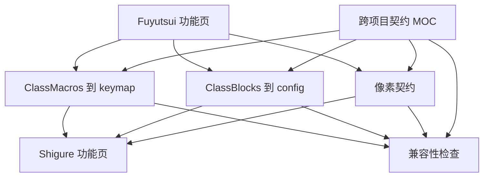

# Shigure 跨项目契约 MOC

## AI 摘要

跨项目契约描述“两个项目必须以完全相同方式理解的事实”，而不是复述两边源码。当前有三条主契约：

- [[40-跨项目/01-Shigure-像素生产消费契约|像素生产消费契约]]：Fuyutsui 如何画，Shigure 如何采样和解码。
- [[40-跨项目/02-Shigure-ClassBlocks到config同步契约|ClassBlocks 到 config 同步契约]]：职业 Lua 声明如何变成 Shigure 的字段映射。
- [[40-跨项目/03-Shigure-ClassMacros到keymap与按键契约|ClassMacros 到 keymap 与按键契约]]：职业宏顺序如何变成可解析、可发送的热键。

契约没有独立协商或握手机制。仓库内置 `Fuyutsui/` 让两端源码能够同版本发布，但不会自动消除协议漂移；任何格式变化仍必须按 [[40-跨项目/04-Shigure-兼容性变更检查清单|兼容性变更检查清单]] 同步修改、重新生成并验证游戏部署副本。

## 范围

本 MOC 负责：

- 定义每条契约的生产者、传输载体、消费者和最终业务输出。
- 路由到本地实现文档和既有深度参考。
- 规定共享事实的唯一归属，防止两边文档各写一套互相漂移的协议。
- 提供协议变更时的影响入口。

不负责：Fuyutsui 每个状态 getter、Shigure 每条模块条件、WinForms 控件布局或 WoW 外部 API 的完整说明。

## 契约输入与输出

| 契约 | 生产输入 | 传输载体 | 消费输出 |
|---|---|---|---|
| 像素 | `Fuyutsui.blocks`、状态值、光环和队伍数据 | 屏幕 RGB：主行、CountBars、吸收网格 | `RowData`、`BarData`、`HealAbsorbData` |
| ClassBlocks | `class/*.lua` 中各专精的 `states/auras/spells/items/group` | Lua 表 → `config/*.json` | `StateBuilder` 可使用的 `step/type/bar/group` 映射 |
| ClassMacros | `core/classmacros.lua` 的职业级 dynamic/static/special 数据 | Lua 表 → `keymap/*.json` + WoW 覆盖绑定 | `(职业、单位、技能、宏条件) → hotkey` |

三条契约最终汇合到 Shigure 的决策路径：原始像素通过 config 变成 `GameState`，module 从 `GameState` 选出技能和单位，再通过 keymap 解析 hotkey。

## 运行链路

```text
内置 ClassBlocks ──部署──> 游戏 ClassBlocks ──LoadPlayerBlocks──> blocks ──绘制──> 屏幕像素
     └──Shigure ConfigConverter──> config ─────────────────────┐
                                                               ├─> GameState
屏幕像素 ──PixelScanner──> RowData / BarData / AbsorbData ─────┘

内置 ClassMacros ──部署──> 游戏 ClassMacros ──CreateMacro──> WoW 覆盖绑定
      └──Shigure KeymapConverter──> keymap ──规则选技能/单位──> hotkey
                                                               └──KeySender──> 覆盖绑定
```

运行时像素链和离线生成链必须来自同一份 Fuyutsui 声明。只更新其中一条会产生可启动但错误的状态。

## 契约不变量

- **同一事实只有一个契约主页。** 项目页可以解释本地算法，但共享字段顺序、字节含义和单位编号必须回链到这里。
- **生产和生成必须同源。** `LoadPlayerBlocks` 与 ConfigConverter 对 `ClassBlocks` 顺序的理解必须一致；`CreateMacro` 与 KeymapConverter 对宏槽位的理解必须一致。
- **内置源单向部署。** 仓库/发布目录中的 `Fuyutsui/` 是唯一权威源，游戏 `Interface/AddOns/Fuyutsui` 是可覆盖的运行副本；同步不删除游戏额外文件，也不把游戏修改反向合并。
- **生成文件可重建。** `config`、`keymap` 是消费端缓存/产物，不是绕过 Lua 源文件的长期修复点。
- **协议变化必须显式。** 当前像素中没有独立版本字节；无法依赖运行时自动协商。
- **名称也是接口。** 状态、光环、技能和动态字段名称进入 JSON 和 module 条件，重命名具有数据迁移成本。

## 失败模式

- Fuyutsui 正确绘制新字段，但 ConfigConverter 仍按旧顺序生成 `step`，导致 Shigure 读取相邻业务值。
- ConfigConverter 已支持新 Lua 结构，但 Fuyutsui `LoadPlayerBlocks` 忽略该结构，生成文件看似正常而屏幕没有输出。
- Fuyutsui 宏槽位偏移改变，而 KeymapConverter 未同步，模块最终按下另一个宏的键。
- 仅检查主色块成功，没有检查 CountBars 和治疗吸收网格的部分失败。
- 手工修复生成 JSON，下一次“更新配置”后问题复现。
- 手工修改游戏 AddOn 副本后，下次启动或全量更新被内置源覆盖，且 config/keymap 仍来自项目源。
- 旧 README 或历史审计被当作当前契约，覆盖了源码中的版本 3 单位迁移和已拆分文件位置。

## 修改影响与路由

| 计划修改 | 必须进入 |
|---|---|
| RGB、像素数量、标记色、条宽高、网格行列 | [[40-跨项目/01-Shigure-像素生产消费契约|像素契约]] |
| `states/auras/spells/items/group` 格式、顺序、占位 | [[40-跨项目/02-Shigure-ClassBlocks到config同步契约|ClassBlocks 契约]] |
| dynamic/static/special 规则、宏键池、单位或条件 | [[40-跨项目/03-Shigure-ClassMacros到keymap与按键契约|宏与热键契约]] |
| 任意共享名称、版本、路径或生成方式 | [[40-跨项目/04-Shigure-兼容性变更检查清单|兼容性检查清单]] |

若修改只属于一端的内部重构，但输入输出完全不变，应在提交说明和功能页中明确“契约未变”。

## 源码索引

| 契约 | Fuyutsui 侧 | Shigure 侧 |
|---|---|---|
| 像素 | `main.lua`、`core/block.lua`、`class/*.lua` | `Runtime/PixelScanner.cs`、`StateBuilder.cs` |
| ClassBlocks | `class/*.lua`、`main.lua:LoadPlayerBlocks` | `Infrastructure/ClassBlocksStore.cs`、`FuyutsuiConfigConverter.cs`、`ConfigService.cs` |
| ClassMacros | `core/classmacros.lua`、`core/macro.lua`、`main.lua:LoadPlayerMacros` | `ClassMacrosStore.cs`、`FuyutsuiKeymapConverter.cs`、`Input/KeymapService.cs` |

## 知识图谱



## 关系

- 上级：[[00-导航/00-Shigure-知识库首页|Shigure 知识库首页]]
- 全景：[[10-系统/00-Shigure-双项目系统全景|双项目系统全景]]
- 生产端：[[20-Fuyutsui/00-Fuyutsui-MOC|Fuyutsui MOC]]
- 消费端：[[30-Shigure/00-Shigure-MOC|Shigure MOC]]
