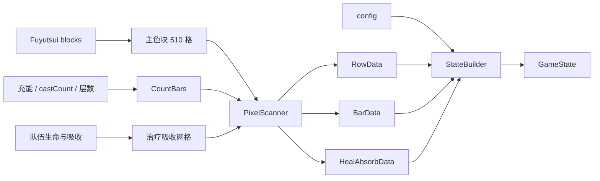

# Shigure 像素生产消费契约

## AI 摘要

屏幕协议包含三个物理上相邻、逻辑上独立的通道：

1. **主色块行**：最多 510 个字段槽，RGB 的红绿通道标识索引，蓝通道携带业务字节。
2. **CountBars**：用标记色、白色 StatusBar 和背景色编码充能、`castCount`、光环层数等段值。
3. **治疗吸收网格**：CountBars 下方最多 6 行、30 个单位，白条后的背景像素携带吸收值和单位编号。

Shigure 可在主色块成功时对后两者降级：找不到 CountBars 标记不会否定已经扫描到的主行，但会返回缺少条和治疗吸收数据的失败说明。诊断时必须分别检查三条通道。

## 范围

本契约定义：

- Fuyutsui 绘制与 Shigure 截图之间可观察的 RGB 事实。
- `PixelScanner` 输出的三组原始字节数据。
- `StateBuilder` 如何使用 config 把这些原始值变成业务状态。
- 生产或消费协议变更时的同步责任。

### 姓名板像素

姓名板使用独立于主色块和 CountBars 的区域。第一行是标记行：首格为 `(1,0,1)`，第二格的 `B` 通道编码数据行数；后续每行固定 20 个槽位。每个槽位的 `R=1` 表示 `nameplateN` 存在，`B` 是该行的 0..255 原始值。配置中的 `healthPercent`、`range` 指定行偏移，光环从两者最大值之后按顺序排列。

本契约不定义 `ClassBlocks` 中业务字段的完整顺序；见 [[50-参考资料/TEXTURE_LAYOUT_zh-CN|纹理排序说明]]。它也不定义 AuraContainer 上游 API；见 [[50-参考资料/AuraContainer_AI_Reference_zh-CN|AuraContainer 技术参考]]。

## 输入与输出

### Fuyutsui 生产端

| 输入 | 输出 |
|---|---|
| `CreateTexture(index, b)` 和运行时业务值 | 主色块中的一格 RGB |
| `CreateAutoLayoutBar`、玩家光环层数布局 | CountBars 段及终点标记 |
| `groupList`、生命值与治疗吸收 | 最多 30 个单位的吸收网格 |

Fuyutsui 内部颜色通道使用 0..1；屏幕采样后 Shigure 读取 0..255 的 `Color.R/G/B`。

### Shigure 消费端

`PixelScanner.ScanScreenData` 返回：

- `RowData: step → valueByte`，找不到有效起始标记时为 `null`。
- `BarData: segmentIndex → value`，缺少 CountBars 时为空字典。
- `HealAbsorbData: unitIndex → absorbValue`，缺少网格时为空字典。
- `FailureReason`，用于区分窗口、客户区、起始标记或 CountBars 的失败。

`StateBuilder.Build` 再把这些值映射成 `GameState`；像素采集器本身不知道字段名称。

`ScreenScanResult.Nameplates` 返回 `1..20` 的 `NameplateScanData`，`Rows[0]` 对应姓名板数据第 1 行。`GameState` 以 `nameplates.<槽位>.<字段>` 提供存在、生命值、距离和光环剩余时间。

## 编码与运行链路

### 主色块行

`PixelScanner` 当前只接受绿通道 `1..255`，并按红通道反解：

| 索引 | 屏幕字节 R | 屏幕字节 G | 屏幕字节 B |
|---:|---:|---:|---|
| `1..255` | `0` | `index` | 业务值 |
| `256..510` | `1` | `index - 255` | 业务值 |

扫描器先在顶部一像素高的截图中寻找 `step == 1` 的起始格，再向右扫描到 `step == 510` 或客户区末尾。重复识别同一 step 时，后读值会覆盖字典中的先前值。

当前约定中：

- 第 1 格是状态像素起始锚点。
- Shigure 使用第 2、3 格的值识别职业和专精，再选择完整 config。
- 其他绝对索引由当前专精 `ClassBlocks` 的实际顺序决定，不能跨专精写死。

### CountBars

Shigure 从客户区左边缘向下寻找红色标记字节 `(1,0,0)`，以该 y 坐标截取整行。随后按当前实现识别：

- 红色后接 `(1,1,0)` 的段起点，或一个新的纯白区域。
- 纯白 StatusBar 后第一个非白像素的绿通道。
- 灰色 `(200,200,200)` 终点标记。

消费值为背景绿通道字节减一，并按从左到右出现的段编号写入 `BarData`。业务字段通过 config 的 `step: "bar"` 和 `bar` 段号读取，不占用主色块 step。

### 治疗吸收网格

扫描从 CountBars 下一行开始，最多检查 6 行。每段先找到纯白起点，跳过连续白色，再读取第一个非白背景像素：

- `G - 1` 是治疗吸收值。
- `B` 是单位编号 `1..30`。

`StateBuilder` 将该值写入每个 `group` 成员的 `治疗吸收`，并在值非零时从扫描到的 `生命值` 中扣除吸收。扣除结果不设下限，可以为 0 或负数，并会参与最低生命值动态单位的比较。因此这里的协议变化不仅影响显示字段，也会改变模块实际使用的队伍生命值。

## 关键不变量

- 主行固定上限是 510；两个索引区必须保持 `R=0/1` 和 `G=1..255` 的字节规则。
- 第一格必须能被识别为 `step=1`，否则整次主行扫描失败。
- RGB 标记必须是未经混色的精确字节；抗锯齿、透明混合、缩放或采样相邻像素会破坏等值判断。
- CountBars 和治疗吸收依赖相同的 marker y；没有 CountBars 标记时，两者都不会采集。
- CountBars 段顺序和 config 中的 `bar` 编号必须一致。
- 治疗吸收单位编号必须落在 `1..30`；其他 B 值被忽略。
- Shigure 使用屏幕截图而非进程内 API；窗口必须存在、未最小化且相应像素可见。
- 协议没有版本字节。任何不兼容更改都必须同时发布两端。

## 失败模式

| 失败 | Shigure 行为 | 诊断重点 |
|---|---|---|
| 找不到目标窗口 | `RowData=null`，返回窗口错误 | 标题、进程和启动参数 |
| 窗口最小化 | `RowData=null` | 恢复窗口后重试 |
| 客户区坐标或尺寸无效 | `RowData=null` | Win32 调用、DPI、窗口生命周期 |
| 找不到 `step=1` | `RowData=null` | 第一格颜色、屏幕位置、缩放、遮挡 |
| 找不到 CountBars 标记 | 主行仍可返回；条和吸收为空 | marker 颜色/y、条是否创建 |
| 索引编码仍合法但顺序漂移 | 扫描成功却映射到错误业务字段 | `ClassBlocks → config` 同步 |
| 吸收网格错误 | 队伍 `治疗吸收` 为 0，生命值不扣除 | 白条、背景 G/B、单位编号和行数 |

## 修改影响

修改以下任一内容时，应同时更新 Fuyutsui、Shigure、本契约和验证样例：

- 510 上限、两段索引编码或主行位置。
- CountBars 的标记色、段起点、终点色、背景绿值或排列顺序。
- 治疗吸收的行数、单位容量、G/B 含义或白条布局。
- `StateBuilder` 对吸收值和生命值的组合语义。
- Fuyutsui 在分辨率、UI 缩放或专精变化时的重排方式。

只改变业务字段顺序而不改变 RGB 算法时，也必须更新 [[40-跨项目/02-Shigure-ClassBlocks到config同步契约|ClassBlocks 到 config 契约]]及生成配置。

## 源码索引

| 职责 | 源码 |
|---|---|
| 主色块、CountBars、吸收网格和 Aura 像素 | `Fuyutsui/core/block.lua` |
| 当前专精索引分配 | `Fuyutsui/main.lua:LoadPlayerBlocks` |
| 队伍列表与吸收刷新入口 | `Fuyutsui/core/group.lua`、`core/events.lua` |
| 屏幕截图和三通道解码 | `Runtime/PixelScanner.cs` |
| 原始值到业务状态 | `Runtime/StateBuilder.cs` |
| config 合并 | `Infrastructure/ConfigService.cs` |

低层生产端细节见 [[50-参考资料/BLOCK_AI_Reference_zh-CN|block 技术参考]]，索引来源见 [[50-参考资料/TEXTURE_LAYOUT_zh-CN|纹理排序说明]]。

## 知识图谱

## 关系

- 上级：[[40-跨项目/00-Shigure-跨项目契约-MOC|跨项目契约 MOC]]
- 生产端：[[50-参考资料/BLOCK_AI_Reference_zh-CN|Fuyutsui block 技术参考]]、[[20-Fuyutsui/07-Fuyutsui-队伍与治疗吸收|队伍与治疗吸收]]
- 消费端：[[30-Shigure/02-Shigure-像素扫描与协议解码|像素扫描与协议解码]]、[[30-Shigure/03-Shigure-配置合并与GameState构建|GameState 构建]]
- 相邻契约：[[40-跨项目/02-Shigure-ClassBlocks到config同步契约|ClassBlocks 到 config]]
