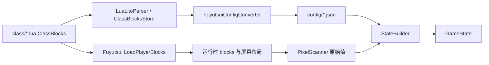

# Shigure ClassBlocks 到 config 同步契约

## AI 摘要

`ClassBlocks` 同时驱动两条必须一致的链路：Fuyutsui 的 `LoadPlayerBlocks` 用它决定真实屏幕索引；Shigure 的 `FuyutsuiConfigConverter` 用它生成相同字段的 `step`、类型和条段映射。若两边对分类顺序、占位数量或队伍偏移的理解不同，截图仍可能成功，但 `GameState` 会把一个字段的字节解释成另一个字段。

当前两条链路都以仓库/发布目录中的 `Fuyutsui/class/*.lua` 为权威源。游戏 `Interface/AddOns/Fuyutsui` 只是由 Shigure 部署的运行副本；在游戏目录手改 ClassBlocks 不会生成 config，并可能在下一次同步被覆盖。

当前主色块分配总顺序是：

```text
states → auras → spells → items → group
```

其中 `states` 的现代分类顺序是：

```text
状态 → 能量 → 配置开关 → 目标 → 焦点 → 鼠标 → 宠物 → 首领1…首领5
```

这份契约规定转换器必须跟随当前 `LoadPlayerBlocks`，而不是跟随旧文档中的简化顺序。

## 范围

本契约覆盖：

- `class/*.lua` 中现代与兼容格式的读取边界。
- Fuyutsui 连续分配主色块、CountBars 和 group 起点的规则。
- Shigure 如何生成 `config/common.json` 和按职业划分的 config。
- `ConfigService` 与 `StateBuilder` 如何消费生成数据。
- Shigure 配置编辑器保存 Lua 后的重生成与运行时重启链路。
- 内置 Lua 到游戏 AddOn 副本的单向部署边界。

像素 RGB 本身由 [[40-跨项目/01-Shigure-像素生产消费契约|像素生产消费契约]] 定义；宏配置由 [[40-跨项目/03-Shigure-ClassMacros到keymap与按键契约|ClassMacros 契约]] 定义。

## 输入与输出

### 输入：Fuyutsui `ClassBlocks`

每个当前职业文件设置 `Fuyutsui.ClassBlocks[specIndex]`，一个专精可包含：

| 区域 | 主要字段 | 作用 |
|---|---|---|
| `states` | 分类数组或兼容的平面数组 | 普通状态、能量、开关和单位字段 |
| `auras` | player、target harmful/helpful、focus harmful/helpful | 按 spell ID 创建光环像素槽，可选层数条 |
| `spells` | `spellId`、charge、maxCharge、castCount 等 | 冷却、充能回充以及派生 CountBars |
| `items` | `[itemId] = { name, isEquipped }` | 背包物品或已装备物品的冷却状态 |
| `group` | `num`、生命值/职责/驱散偏移、成员光环 | 从 `start` 起按成员步长布局最多 40 个单位 |

只有当前玩家职业的 Lua 文件会实际写入 `Fuyutsui.ClassBlocks`。

### 输出：Shigure `config`

生成配置表达的是“如何读取像素”，典型字段包含：

- `step: 1..510`：主色块绝对列。
- `step: "bar"` 与 `bar: N`：CountBars 段号。
- `type: int|bool|string`：原始字节的业务转换。
- `group.start`：首位成员的主色块起点。
- `group.num`：每位成员的步长。
- group 子字段数字 `step`：相对成员起点的偏移。

`common.json` 提供启动阶段固定字段，当前 `StateBuilder` 直接用主行第 2、3 格取得职业和专精，再通过 `ConfigService.BuildStateConfig` 合并相应职业/专精配置。

## 分配与同步链路

### Fuyutsui 运行时分配

1. `LoadPlayerBlocks(specIndex)` 从索引 1 开始创建新的 `blocks`。
2. `states` 按现代分类固定顺序展开；状态/能量/配置开关使用裸名称，单位分类使用分类前缀形成运行时 key。
3. `auras` 依次展开 player、target harmful、target helpful、focus harmful、focus helpful。条目必须有 `spellId` 或 `spellIds`，否则被跳过并提示。
4. `spells` 按数组顺序展开：普通条目占一格；`charge=true` 占冷却和充能回充两格。`maxCharge` 与正数 `castCount` 额外生成 CountBars 定义，但不占主行新字段。
5. `items` 按 `itemId` 升序展开，每项占一格，同时写入 `blocks.state[name]` 与 `blocks.items[itemId]`。
6. 若存在 `group`，记录当前索引为 `groups.start`，成员像素按 `start + (memberIndex - 1) * num + offset` 计算。
7. 替换 `self.blocks` 后释放旧单位、队伍及特定光环容器，后续刷新按新布局重建。

### Shigure 生成与消费

1. `FuyutsuiConfigConverter.UpdateFromClassDirectory` 枚举职业 Lua 文件并解析 `ClassBlocks`。
2. 转换器必须用与上方完全一致的顺序计算 `step` 和 bar 段。
3. 生成的 JSON 写入 Shigure `config` 目录；`ConfigService` 加载并按职业/专精合并。
4. `StateBuilder` 用 `step/type/bar` 构建普通字段、`Auras`、`Spells` 和 30 个 `Group` 成员。
5. 配置页保存时，`ClassBlocksStore` 通过 `LuaLiteParser` 定位并替换表字面量，然后触发同一转换、目录刷新与运行时重启。
6. 保存入口只部署当前职业 Lua；“更新配置”和程序启动会全量校验内置插件。游戏同步失败不回滚项目 Lua 或已生成 JSON。

## 关键不变量

- Fuyutsui 分配器与 Shigure 转换器必须共享相同的**分类顺序、跳过规则和每条占位数**。
- 主色块索引必须连续；CountBars 段独立编号，不应增加主色块 index。
- Aura 条目缺少 `spellId/spellIds` 时生产端不会分配槽；转换端不得为其生成可读 step。
- 相同 `spellId` 的重复声明可能复用运行时字典项并造成索引语义不清，职业数据应避免重复。
- group 数字偏移是相对值，`start` 是绝对值，`num` 是成员步长；三者不可混用。
- 状态名称必须能在 `core/stateblocks.lua` 找到写入路径，且 Shigure 字段目录、module 条件和 UI 使用相同名称。
- 保存 Lua 后必须重新生成 config 并重启或刷新运行时；旧内存配置不能继续消费新布局。
- 运行 AddOn 必须来自同一内置源版本；游戏副本的同名文件应与项目源 SHA-256 一致，额外文件不属于同步一致性保证。
- `config` 是生成物。若手工修改，必须确认下一次转换不会覆盖，通常应改 Lua 或转换器。

## 失败模式

| 失败 | 结果 |
|---|---|
| 新增状态但没有 state getter | 有索引和 config，屏幕业务值长期为默认值 |
| 两端分类顺序不一致 | 后续所有字段发生累计错位 |
| 转换端为缺失 spell ID 的 aura 占位 | Shigure 从后续字段读取错误 aura |
| charge 一端按一格、另一端按两格 | 从该技能开始的 spells/group 全部错位 |
| group `step` 被当绝对索引 | 只有首位或所有成员字段读取错误 |
| LuaLiteParser 遇到不支持的动态 Lua 表达式 | 编辑器无法可靠 round-trip，保存可能被拒绝 |
| `wow_process.txt` 选错实例或目标不可写 | UI 编辑和本地生成成功，但实际运行 AddOn 未变化 |
| 手改游戏副本 ClassBlocks | config 不会重生成，且下次部署可能覆盖改动 |
| 只写生成 JSON | 下一次“更新配置”恢复旧错误 |

## 修改影响

### 修改 Fuyutsui 职业结构时

- 同步检查 `main.lua:LoadPlayerBlocks`。
- 同步检查 `ClassBlocksStore` 和 `FuyutsuiConfigConverter`。
- 更新 [[50-参考资料/TEXTURE_LAYOUT_zh-CN|纹理排序说明]]及本契约。
- 重新生成所有受影响职业 config，并比较变化是否从预期字段开始。
- 在游戏中切换相关专精，确认旧光环/条/队伍槽已释放并重建。

### 修改 Shigure config schema 时

- 更新 `ConfigService`、`StateBuilder`、字段目录和编辑器。
- 为现有生成 JSON 提供重生成路径；若 module 引用字段名变化，还需数据迁移。
- 确认 Fuyutsui 屏幕生产语义未被无意改变。

## 源码索引

| 职责 | 源码 |
|---|---|
| 当前职业声明 | `Fuyutsui/class/*.lua` |
| 主色块与 bar 分配 | `Fuyutsui/main.lua:LoadPlayerBlocks` |
| 状态名到写入 getter | `Fuyutsui/core/stateblocks.lua` |
| Aura、CountBars、group Aura | `Fuyutsui/core/block.lua` |
| Lua 子集解析 | `Infrastructure/LuaLiteParser.cs` |
| 可视化配置 round-trip | `Infrastructure/ClassBlocksStore.cs` |
| Lua 到 JSON 转换 | `Infrastructure/FuyutsuiConfigConverter.cs` |
| 项目源到游戏副本 | `Infrastructure/FuyutsuiAddonSyncService.cs`、`WowAddonLocator.cs` |
| config 合并 | `Infrastructure/ConfigService.cs` |
| config 到状态 | `Runtime/StateBuilder.cs` |

## 知识图谱



## 关系

- 上级：[[40-跨项目/00-Shigure-跨项目契约-MOC|跨项目契约 MOC]]
- 生产模型：[[50-参考资料/TEXTURE_LAYOUT_zh-CN|Fuyutsui 纹理排序说明]]、[[20-Fuyutsui/03-Fuyutsui-状态块与编码入口|状态块与编码入口]]
- 消费模型：[[30-Shigure/03-Shigure-配置合并与GameState构建|配置合并与 GameState]]
- 编辑链路：[[30-Shigure/09-Shigure-Fuyutsui配置宏编辑与同步|Fuyutsui 配置宏编辑与同步]]
- 相邻契约：[[40-跨项目/01-Shigure-像素生产消费契约|像素生产消费契约]]
