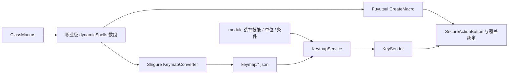

# Shigure ClassMacros 到 keymap 与按键契约

## AI 摘要

同一份 `Fuyutsui.ClassMacros[classFile]` 有两个消费者：Fuyutsui 把宏按固定顺序展开为 SecureActionButton 并绑定预设热键；Shigure 按同一顺序生成 keymap，让 module 能把“技能 + 单位 + 宏条件”反解为那个热键。如果槽位顺序、动态宏占位、单位编号或宏文本解析有任何漂移，Shigure 会发送一个合法但属于其他宏的按键。

这份宏数据的权威位置是项目内置 `Fuyutsui/core/classmacros.lua`。宏编辑器保存后从这里重生成 keymap，并把该 Lua 单文件部署到游戏；游戏副本不是反向编辑源。

当前宏顺序是：

```text
dynamicSpells（每项展开 30 个团队槽）
  → staticSpells
  → specialSpells
```

`dynamicSpells` 只保存职业级数组；Fuyutsui 运行时和 Shigure 转换器按同一顺序展开，不再生成专精 keymap。宏键池容量由 26 组左右修饰符 × 45 个主键决定，共 1170 个组合。不含 F4、反引号、NUMPADENTER、数字主键和斜杠主键。新增主键只能往 `keys` 末尾追加，插入中间会平移后续槽位。

## 范围

本契约覆盖：

- `MacroBodies` 和 `ClassMacros` 的数据角色。
- dynamic/static/special 的展开顺序与槽位消耗。
- Fuyutsui 的安全按钮与覆盖绑定。
- Shigure `keymap/*.json` 的生成、选择和查找维度。
- module 单位、宏条件、特殊动作到 hotkey 的衔接。
- Shigure Windows 按键发送到 WoW 覆盖绑定的最后一跳。

本契约不定义动作选择条件；见 [[30-Shigure/06-Shigure-规则条件与特殊动作|Shigure 规则条件与特殊动作]]。动作条原生技能扫描是另一条 Fuyutsui 本地功能，见 [[20-Fuyutsui/09-Fuyutsui-动作条键位扫描|动作条键位扫描]]。

## 输入与输出

### 输入：Fuyutsui 宏数据

| 数据 | 含义 | 槽位行为 |
|---|---|---|
| `Fuyutsui.MacroBodies` | 可复用的命名宏体 | 被条目按名称解析，不单独占槽 |
| `dynamicSpells` | 对队伍/团队单位展开的技能 | 每个条目连续占 30 个单位槽 |
| `staticSpells` | 普通技能或可解析宏条目 | 每项占一个槽，空字符串保留位置 |
| `specialSpells` | 完整特殊宏文本；行尾注释是手工技能名 | 在 static 之后逐项占槽，保留顺序；Shigure 固定映射为无目标、无宏条件 |

`LoadPlayerMacros` 按当前职业读取 `dynamicSpells` 职业级数组，再交给 `CreateMacro`；专精切换不会选择另一份宏表。

### 输出：两端的一致映射

Fuyutsui 输出：

- 按槽位命名的 SecureActionButton。
- 每个按钮的宏文本。
- key pool 对应的 `SetOverrideBindingClick` 绑定。

Shigure 输出：

- 按职业选择的 keymap 条目（专精参数仅为兼容调用保留）。
- 由 `KeymapService.GetHotkey(unit, spell, macroCondition)` 返回的 hotkey。
- `KeySender` 面向目标窗口的发送结果。
- 内置 `classmacros.lua` 部署到游戏 AddOn 后由 WoW 实际加载的宏按钮与绑定。

keymap 是生成物；宏 Lua 与两端一致的展开算法才是来源。

## 单位与宏条件

当前保留单位编号：

| 编号 | 语义 |
|---:|---|
| `0` | 无目标 |
| `1..30` | 队伍/团队槽位，也是 dynamic 展开的 30 个目标 |
| `31` | 玩家 |
| `32` | 当前目标 |
| `33` | 焦点 |
| `34` | 地面/光标位置 |
| `35` | 鼠标指向 |

当前 module `UnitMappingVersion` 是 3。历史记录中的单位 `36/37` 会由 `MacroConditionText.NormalizeLegacyUnit` 转成 `unit=0` 加 `channeling/nochanneling` 宏条件。新数据不得继续把 36/37 当真实单位。

## 运行与生成链路

### Fuyutsui

1. `LoadPlayerMacros` 按当前职业和专精解析 dynamic 列表。
2. `CreateMacro` 依次展开 dynamic、static、special。
3. `resolveMacroBody` 解析命名宏体或直接文本。
4. 创建 SecureActionButton，写入宏属性，并把当前槽位的预设按键绑定到按钮点击。
5. 清理或重建必须遵守 `InCombatLockdown`；战斗中不能任意修改安全按钮和绑定。

### Shigure

1. `ClassMacrosStore` 与 `LuaLiteParser` 读取同一 `ClassMacros` 表，并保留数组空槽和行尾注释。
2. `FuyutsuiKeymapConverter` 按 dynamic 每项 30 槽，再 static、special 的顺序遍历同一 key pool。
3. 转换器从 dynamic/static 条目提取技能名、单位与可选宏条件；special 不解析正文，只读取行尾注释中的手工技能名，并固定写成无目标、无宏条件。
4. `KeymapService` 根据当前职业/专精选择数据，并以 unit、spell、condition 查找 hotkey。
5. module 可直接提供 hotkey，或提供技能/动态单位后通过 keymap 解析；特殊动作可能先从 `GameState` 解析实际技能。
6. `ShigureRuntime` 应用规则延迟和逻辑延迟后调用 `KeySender`；目标窗口收到的键应命中 Fuyutsui 覆盖绑定或游戏动作条。
7. `KeySender` 与扫描器共用 `WowProcessLocator`，并核对本轮扫描句柄；目标窗口切换时不向陈旧窗口发送。

## 关键不变量

- Fuyutsui `CreateMacro` 和 Shigure KeymapConverter 必须使用同一个 key pool、同一遍历顺序和同一空槽保留规则。
- 一个 dynamic 条目固定占 30 个连续目标槽；不能只按实际队伍人数缩短。
- Lua 与 C# 必须按同一职业数组顺序展开，否则从第一个条目开始整体偏移。
- 空 static/special 槽若用于稳定偏移，转换和序列化时不得自动删除。
- 技能名、单位和宏条件共同决定 keymap 命中；只按技能名查找可能选错目标宏。
- module 单位迁移必须在规则解析前完成，当前保存版本为 3。
- 宏槽总数不能超过 key pool；溢出不得静默复用已有按键。
- 生成 keymap 后必须让运行时和编辑器目录重新加载。
- 生成 keymap 的内置宏源与游戏加载的部署副本必须一致；保存后的单文件部署失败必须显式提示。
- 安全按钮的创建、清理和覆盖绑定修改必须遵守 WoW 战斗锁定。

## 失败模式

| 失败 | 表现 |
|---|---|
| dynamic 一端按 30 槽、另一端按实际人数 | 第一个 dynamic 后所有热键错位 |
| 职业数组顺序不同 | 该职业从首个差异处开始发送错误按键 |
| 序列化删除空数组项 | 后续 static/special 槽全部前移 |
| 宏文本无法提取技能名 | keymap 缺项，module 命中但无 hotkey |
| 单位或宏条件归一化不一致 | 同技能解析到错误目标或找不到映射 |
| 超过键池容量 | 尾部宏无法创建或转换，无可靠热键 |
| 战斗中重建安全按钮 | WoW 拒绝操作或产生受保护动作错误 |
| 只更新 Lua 未重生成 keymap | 游戏内宏已变，Shigure 仍发送旧槽位 |
| 目标进程未配置、窗口切换或按键解析失败 | 决策正确但 KeySender 返回失败 |
| keymap 已更新但宏 Lua 未部署/重载 | Shigure 发送新槽位，游戏仍执行旧宏 |

## 修改影响

修改宏数据格式、热键池或单位映射时，至少同步检查：

- `Fuyutsui/core/classmacros.lua`、`core/macro.lua` 和 `main.lua:LoadPlayerMacros`。
- `ClassMacrosStore`、`FuyutsuiKeymapConverter`、`KeymapService` 和 `KeymapCatalog`。
- module schema、宏快照迁移函数和职业级宏容量检查。
- 宏编辑器的槽位提示、空槽保存与保存后同步。
- [[50-参考资料/CLASSMACROS_AI_Reference_zh-CN|ClassMacros 规则参考]]、`Fuyutsui/core/keybinds.lua`（当前键池编码）和本契约。

验证不能只比较生成 JSON 的条目数；应抽查 dynamic 首尾、static 首项、special 首项以及不同专精边界处的实际 hotkey。

## 源码索引

| 职责 | 源码 |
|---|---|
| 职业宏与命名宏体 | `Fuyutsui/core/classmacros.lua` |
| 槽位展开、安全按钮、覆盖绑定 | `Fuyutsui/core/macro.lua` |
| 当前职业/专精解析 | `Fuyutsui/main.lua:LoadPlayerMacros` |
| Lua 宏 round-trip | `Infrastructure/ClassMacrosStore.cs` |
| Lua 到 keymap | `Infrastructure/FuyutsuiKeymapConverter.cs` |
| keymap 选择和查找 | `Input/KeymapService.cs`、`KeymapCatalog.cs` |
| 单位和旧条件迁移 | `Modules/ReservedUnit.cs`、`ModuleStore.cs` |
| 规则到决策 | `Modules/ModuleStore.cs`、`LogicRegistry.cs` |
| Windows 按键输出 | `Input/KeySender.cs`、`NativeMethods.cs` |
| 游戏宏副本部署 | `Infrastructure/FuyutsuiAddonSyncService.cs`、`WowProcessLocator.cs` |

## 知识图谱



## 关系

- 上级：[[40-跨项目/00-Shigure-跨项目契约-MOC|跨项目契约 MOC]]
- 生产端规则：[[50-参考资料/CLASSMACROS_AI_Reference_zh-CN|Fuyutsui ClassMacros 规则参考]]
- 消费与执行：[[30-Shigure/08-Shigure-Keymap解析与按键发送|Shigure Keymap 与按键发送]]
- 编辑同步：[[30-Shigure/09-Shigure-Fuyutsui配置宏编辑与同步|Fuyutsui 配置宏编辑与同步]]
- 验收：[[40-跨项目/04-Shigure-兼容性变更检查清单|兼容性变更检查清单]]
