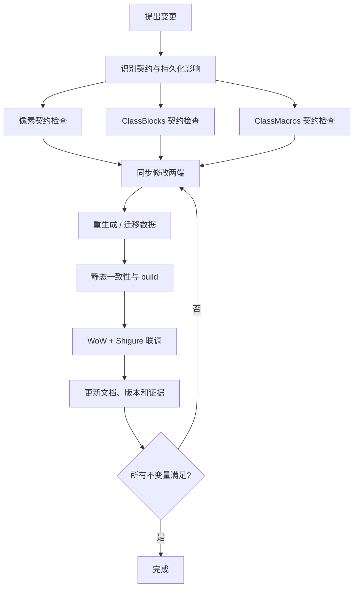

# Shigure 兼容性变更检查清单

## AI 摘要

本清单把一次修改转换成“受影响契约、两端代码、生成数据、文档和验证证据”的闭合集合。最高风险不是显式崩溃，而是静默漂移：像素仍能扫描、JSON 仍能加载、按键仍能发送，但字段或宏已经对应到错误语义。

执行原则：

1. 先识别改动是否改变输入、输出、顺序、名称、编号、容量或生命周期。
2. 若改变，选择对应契约并同时修改生产者与消费者。
3. 重新生成而不是手修缓存数据。
4. 做静态一致性检查、构建检查和实际 WoW/窗口走查。
5. 更新文档状态和 `verified_at`，留下可复核证据。

## 范围、输入与输出

输入可以是源码修改、配置编辑、重构、版本升级或旧数据迁移。清单输出应至少包含：

- 变更分类和受影响契约。
- Fuyutsui 与 Shigure 的最小同步修改集。
- 需要重新生成或迁移的数据。
- 可执行的静态、构建和游戏内验证步骤。
- 已更新的功能页、契约页和版本信息。

纯文案或不改变输入输出的内部重构也应说明“契约未变”，但无需机械执行不相关的游戏验证。

## 变更分类

| 变更 | 契约入口 | 典型影响 |
|---|---|---|
| 主色块数量、RGB、标记或物理布局 | [[40-跨项目/01-Shigure-像素生产消费契约|像素契约]] | `core/block.lua`、PixelScanner、StateBuilder、截图验证 |
| `states/auras/spells/items/group` 结构或顺序 | [[40-跨项目/02-Shigure-ClassBlocks到config同步契约|ClassBlocks 契约]] | LoadPlayerBlocks、Store、Converter、config、module 字段 |
| 宏顺序、动态占位、热键池 | [[40-跨项目/03-Shigure-ClassMacros到keymap与按键契约|宏与热键契约]] | CreateMacro、KeymapConverter、keymap、实际绑定 |
| 单位编号、宏条件、module schema | 宏与热键契约 | 版本常量、迁移、编辑器、已有 module JSON |
| `GameState` 名称或类型 | ClassBlocks 契约 | config、条件字段目录、规则、动态字段、UI |
| AuraContainer API 或秘密值策略 | 像素/ClassBlocks 契约 | Fuyutsui Aura 槽、版本固定参考、游戏内验证 |
| 随机副本、基础目录、文件位置 | 系统全景 | AppPaths、生成文件、module/cache、打包流程 |
| 内置插件布局、部署或目标进程定位 | 系统全景/ClassBlocks/宏契约 | csproj、AddonSyncService、wow_process.txt、游戏运行副本 |
| 运行间隔、触发模式、会话协调 | Shigure 运行时 | 延迟语义、命令队列、快照和 UI |

## 变更运行链路

对任何跨项目修改执行：

```text
提出变更
  → 标记受影响的契约和不变量
  → 搜索当前符号与所有消费者
  → 修改生产端和消费端
  → 重新生成 config / keymap 或迁移 module
  → 静态一致性检查
  → dotnet build
  → WoW / Shigure 实际链路验证
  → 更新文档、版本和验证日期
```

如果中间发现“当前源码与参考文档不同”，以源码为基线，并把参考文档标为 `needs-review`、`version-pinned` 或 `historical`。

## 修改前检查

### 共同检查

- [ ] 用符号搜索确认当前实现文件，不使用历史审计中的旧行号。
- [ ] 阅读 [[10-系统/00-Shigure-双项目系统全景|双项目系统全景]]和受影响契约。
- [ ] 列出生产者、消费者、生成物和已有持久化数据。
- [ ] 判断变更是向后兼容、需要迁移，还是必须同时发布。
- [ ] 记录当前 Fuyutsui `## Version`、接口版本和 Shigure 程序版本。
- [ ] 确认没有把用户本地 `module/`、`cache/` 或游戏目录内容误当仓库默认数据覆盖。
- [ ] 确认修改的是项目/发布目录中的 `Fuyutsui/` 权威源，而不是游戏 AddOns 运行副本。

### 像素协议

- [ ] 主行上限、`R/G` 索引分段和 B 业务字节是否变化。
- [ ] `step=1` 起始锚点是否仍可精确识别。
- [ ] 第 2、3 格的职业/专精启动语义是否保持。
- [ ] CountBars 红/红绿/白/灰标记、段顺序和 `G-1` 是否变化。
- [ ] 治疗吸收最多 8 行、40 单位及 `G-1/B=unit` 是否变化。
- [ ] 窗口缩放、DPI、分辨率或 UI 缩放是否影响整数像素采样。

### ClassBlocks/config

- [ ] `states` 分类顺序是否仍为状态、能量、物品、配置开关、目标、焦点。
- [ ] Aura 缺失 spell ID 时，两端是否都跳过而不占位。
- [ ] 普通 spell 一格、charge spell 两格的规则是否一致。
- [ ] `maxCharge/castCount/maxApps` 的 bar 顺序是否一致。
- [ ] group 的 `start/num/相对 step` 是否保持。
- [ ] 新状态名是否有 Fuyutsui 写入 getter、Shigure 字段类型和 UI 目录。
- [ ] 是否需要重生成所有职业，还是只影响一个职业/专精。

### ClassMacros/keymap/module

- [ ] dynamic 是否仍按每项 40 槽展开。
- [ ] `common + 当前 spec` 的合并顺序是否一致。
- [ ] static/special 空槽是否被完整保留。
- [ ] key pool 顺序和容量是否在两端一致且未溢出。
- [ ] 单位 `0,1..35` 与宏条件归一化是否保持；不得新增使用 36/37 的当前数据。
- [ ] module `CurrentUnitMappingVersion` 是否需要递增并提供幂等迁移。
- [ ] 宏文本中的技能名、单位和条件能否被转换器稳定提取。

## 修改后验证

### 静态一致性

- [ ] `Fuyutsui.toc` 包含所有新增 Lua 文件，且顺序满足依赖。
- [ ] 搜索旧字段名、旧单位编号、旧 API 和旧文件路径，无意外残留。
- [ ] 对受影响职业重新生成 config/keymap，并检查 diff 只从预期边界变化。
- [ ] 抽查生成数据的首项、末项和每个区域边界，而不只比较文件数。
- [ ] 检查 module 迁移重复加载是否保持幂等。
- [ ] Obsidian 链接无未解析目标，新增功能页已进入 MOC。

### Shigure 构建与桌面走查

- [ ] `dotnet build` 成功，且不把 `bin/obj` 产物纳入文档改动。
- [ ] 设置 `SHIGURE_RANDOMIZED_PROCESS=1` 时可进行可控调试；正常启动时随机副本仍能回溯原始数据目录。
- [ ] 三种触发模式中受影响路径行为符合预期。
- [ ] config/keymap 更新任务串行完成后，运行会话正确重启。
- [ ] 发布目录保留完整 `Fuyutsui/` 和 `wow_process.txt`，随机副本仍通过原始业务根读取它们。
- [ ] 状态、队伍、逻辑和日志页展示同一轮快照，没有旧会话覆盖新会话。

### WoW 联调

- [ ] 普通窗口状态下能找到主行起始格并读到职业/专精。
- [ ] 启动全量部署和保存单文件部署都指向 `wow_process.txt` 选中的游戏；相同文件跳过、不同文件覆盖、额外文件保留。
- [ ] 分别验证主行、至少一个 CountBars 段和一个治疗吸收单位。
- [ ] 切换受影响专精/天赋后，索引、Aura 容器和条布局被重建，没有旧数据残留。
- [ ] 小队与团队各验证一个 group 字段及动态单位目标。
- [ ] 抽查 dynamic 首尾、static 首项、special 首项的实际热键和目标。
- [ ] 战斗中不会尝试非法重建 SecureActionButton；离开战斗后同步路径可恢复。
- [ ] 窗口最小化、找不到窗口和缺少 CountBars 时，Shigure 给出预期降级或错误信息。

## 关键不变量与阻断条件

以下任一项不满足，不应把跨项目变更标记完成：

- 两端对相同字节、step、bar、unit 或宏槽位给出不同解释。
- 只能靠手工编辑生成 JSON 才能工作。
- 迁移会在第二次加载继续改变数据，或会丢弃未知用户字段。
- 仅做静态推断却把 WoW API、安全按钮或屏幕采样结论写成已验证事实。
- 文档仍把不存在的文件、拆分前行号或历史版本当作当前入口。

## 常见失败模式

- **局部成功掩盖整体失败**：主行能读，但 CountBars/吸收网格为空。
- **缓存掩盖转换错误**：旧 config/keymap 恰好可用，重新生成后才暴露漂移。
- **名称迁移遗漏**：编译通过，但已有 module 条件永不命中。
- **专精边界未测试**：通用宏正常，某专精 dynamic 导致后续槽位错位。
- **测试环境改变协议**：窗口缩放、遮挡或 DPI 使像素颜色不再精确。
- **文档时间错位**：按旧 `main.lua:1xxx` 行号实施修复，实际逻辑已迁往 `core/*.lua`。

## 已知文档偏差状态

- 旧外部 Fuyutsui 资料曾把 `auracontainer.lua` 列入结构；当前内置目录没有该文件，加载事实以 `Fuyutsui.toc` 为准。
- `UnitMappingVersion` 当前为 4；迁移事实以 `ModuleStore.cs` 与 `ReservedUnit.cs` 为准。
- [[50-参考资料/OPTIMIZATION_zh-CN|Fuyutsui 优化建议]] 是拆分前源码的静态审计，保留历史价值，但其中 `main.lua` 千行行号不能用于当前定位。
- [[50-参考资料/AuraContainer_AI_Reference_zh-CN|AuraContainer 参考]] 固定到特定 PTR build；正式服或新构建的 API 结论必须重新验证。

## 修改影响与文档收尾

变更完成后：

1. 更新受影响功能页和契约页的 `verified_at`。
2. 把验证环境、无法验证项和降级行为写清楚。
3. 对生成物、module schema 或单位映射变化写迁移说明。
4. 更新 README 的用户可见结构或示例，但不要让 README 成为协议的第二份权威实现。
5. 在知识库首页的任务路由中加入新的独立契约；若只是已有功能扩展，链接到现有页而不制造碎片节点。

## 源码索引

| 检查面 | 当前入口 |
|---|---|
| 加载与版本 | `Fuyutsui/Fuyutsui.toc`、`Shigure.csproj` |
| 像素生产/消费 | `Fuyutsui/core/block.lua`、`Runtime/PixelScanner.cs` |
| ClassBlocks 双实现 | `Fuyutsui/main.lua`、`Infrastructure/FuyutsuiConfigConverter.cs` |
| ClassMacros 双实现 | `Fuyutsui/core/macro.lua`、`Infrastructure/FuyutsuiKeymapConverter.cs` |
| 状态消费 | `Runtime/StateBuilder.cs`、`Modules/ModuleStore.cs` |
| 单位迁移 | `Modules/ReservedUnit.cs`、`ModuleStore.cs` |
| 会话与路径 | `App/RuntimeSessionCoordinator.cs`、`RandomizedExecutableLauncher.cs`、`Infrastructure/AppPaths.cs` |
| 内置插件部署 | `Infrastructure/FuyutsuiAddonSyncService.cs`、`WowAddonLocator.cs`、`WowProcessLocator.cs`、`Shigure.csproj` |

## 知识图谱



## 关系

- 上级：[[40-跨项目/00-Shigure-跨项目契约-MOC|跨项目契约 MOC]]
- 像素门禁：[[40-跨项目/01-Shigure-像素生产消费契约|像素生产消费契约]]
- 配置门禁：[[40-跨项目/02-Shigure-ClassBlocks到config同步契约|ClassBlocks 到 config 同步契约]]
- 热键门禁：[[40-跨项目/03-Shigure-ClassMacros到keymap与按键契约|ClassMacros 到 keymap 与按键契约]]
- 历史审计：[[50-参考资料/OPTIMIZATION_zh-CN|Fuyutsui 优化建议]]
