# Shigure 使用说明

Shigure 是一款 Windows 桌面辅助工具：读取目标窗口中 Fuyutsui 插件绘制的状态，依据职业配置、按键映射和模块规则给出下一步操作，并通过置顶浮动条显示运行状态。

FAQ

> 问：是否会被封号？  
> 答：会的。这是个病毒，使用后电脑会原地爆炸！

> 问：它是否开启后就能使用？  
> 答：不是。Shigure需要一定自理能力才能使用


> 使用前请确认符合所在地法律法规，以及目标游戏、平台和服务的用户协议。软件按 MIT License 发布，使用风险由用户自行承担。


## 1. 安装Shigure

- 确保系统是：Windows 10/11
- 安装依赖：[.NET 10 SDK](https://dotnet.microsoft.com/en-us/download/dotnet/thank-you/sdk-10.0.401-windows-x64-installer)（从源码运行时需要）
- 下载 [ShigureReleaseBuilder.exe](https://github.com/waynebian01/Shigure/releases/download/1.2.1.19/ShigureReleaseBuilder.exe)
- 打开 ShigureReleaseBuilder.exe

- 输入软件名称、公司名称、插件名称，这样将降低被查封的可能性，注意插件名称将决定插件宏命令，比如输入Test，那么游戏内的宏命令将以 /te 开头
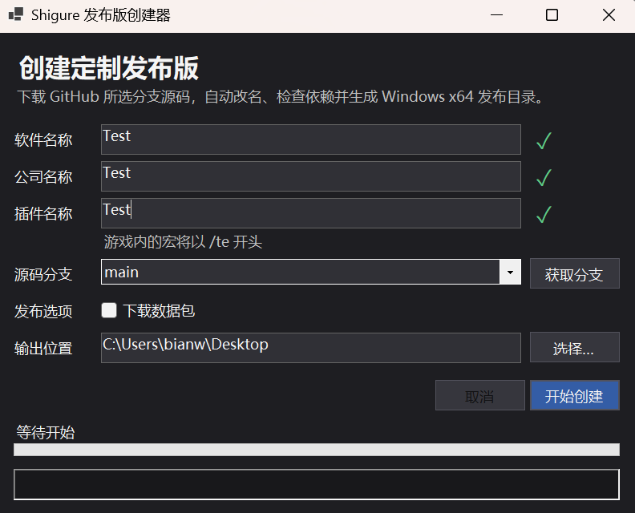

- 点击开始创建，创建成功后将会自动打开文件夹

- 恭喜你，你已经有一份自己独一份的Shigure

- 将文件复制到喜欢的文件夹

## 2. 启动程序

- 启用程序后将确认权限，点击“是”
- 将会出现主界面（如图）

- 显示内容分别是图标、软件名称（显示你自定义的名称）、开启/关闭按钮、设置、关闭
    1. 图标会根据扫描到的职业更改颜色
    2. 软件名称白色为未启动，绿色为启动

## 3. 第一次使用

1. 启动游戏，出现角色选择界面。
2. 启动 Shigure，确认主界面出现。
3. 点击“设置”，进入“通用”页。
4. 点击“更新配置”，等待配置生成和插件同步完成。
5. 选择触发键与发送模式，保存后关闭设置窗口。
6. 进入游戏。

## 4. 通用设置

“通用”页用于设置触发方式、模块选择和插件同步。

- `switch`：按一次开启，再按一次关闭。
- `click`：每次按下只执行一轮逻辑。
- `hold`：按住触发键运行，松开停止。
- 支持键盘按键、`XBUTTON1` 和 `XBUTTON2`。
- 模块可按当前职业、专精、英雄天赋和队伍类型自动匹配，也可以手动指定。

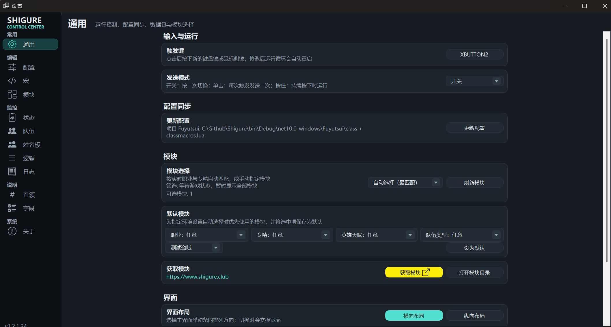

## 5. 配置页

“配置”页编辑职业状态、光环、冷却、队伍、姓名板字段。

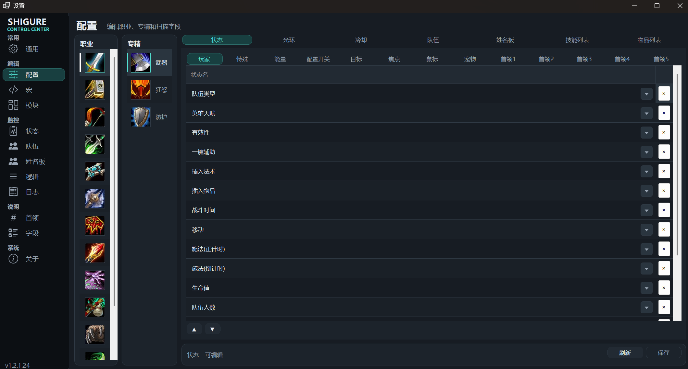
1. 状态包含玩家、目标、焦点、鼠标、宠物、首领1-5的基本状态，获取的信息固定，只能在已有的选项里添加
2. 光环包含玩家、目标、焦点，其中友善目标和友善焦点只能获取buff，敌对目标和敌对焦点只能获取debuff
3. 冷却包含技能冷却和物品冷却。技能冷却输入spellId，如果技能有充能，则勾选充能并输入最大充能数；有施法次数则输入施法次数上限，有些技能可能没有学习，但也想监控CD，则勾选强制已学或在法术书中。
4. 队伍是监控队伍状态，点击启用就会获取队伍的信息，如果需要监控某个光环则就要输入spellId。
5. 姓名板会获取敌对单位的信息，需要在游戏内开启敌对姓名板，

## 6. 宏页

“宏”页编辑职业级动态宏、静态宏和特殊宏：

- 动态宏每项占用 30 个团队点名槽位，一般治疗会使用。
- 静态宏和特殊宏各占用 1 个槽位。
- 静态宏会自动匹配规则，尽量写的简单些。
- 特殊宏的技能名需要手动填写。
- 生成 keymap 时会按动态宏、静态宏、特殊宏的顺序分配热键。

程序会检查职业宏总容量，超过 1144 个槽位时拒绝写入，避免破坏已有映射。

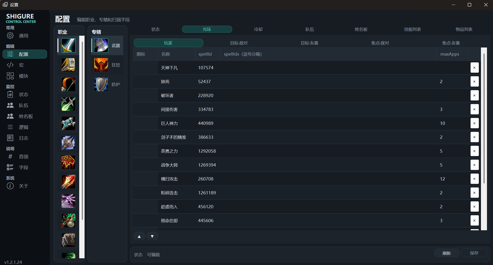

## 7. 模块编辑

“模块”页是日常使用的核心。一个模块包含匹配条件、动态字段和按顺序执行的规则。

新建模块时建议依次填写：

1. 模块名称和作者。
2. 职业、专精、队伍类型、英雄天赋等匹配条件。
3. 动态单位、数量字段或动态数值。
4. 规则中的技能、目标和条件。
5. 保存并刷新模块。

匹配字段留空表示任意。多个模块同时命中时，程序优先选择匹配字段更多的模块，同等条件按名称排序。推荐天赋只用于展示，不参与匹配。


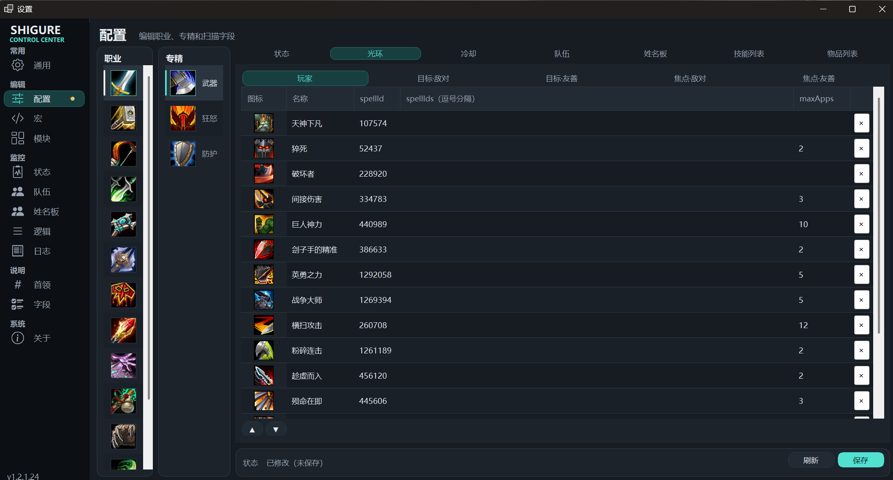

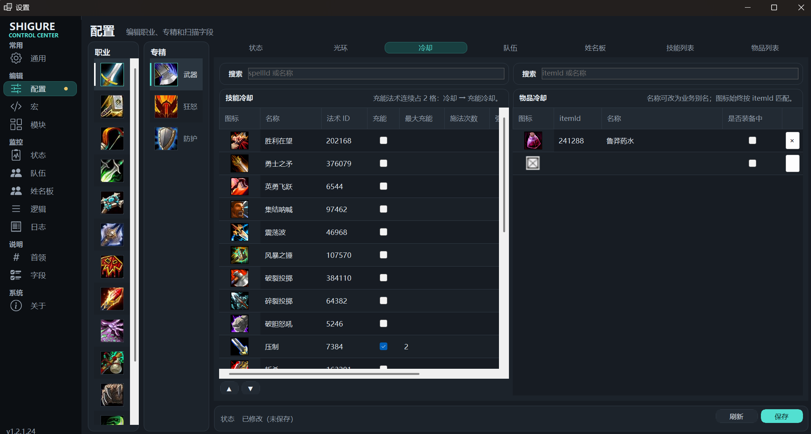

## 8. 规则与动态字段

规则支持启用/停用、条件编辑、复制、插入、上移、下移和拖拽排序。条件可以使用状态值、光环、技能、物品、队伍和动态字段。

动态单位用于把规则目标指向玩家、目标、焦点、队伍成员或鼠标指向；动态数量和动态数值用于表达“数量达到阈值”“百分比低于阈值”等条件。列表中的摘要与运行时使用同一套字段描述。

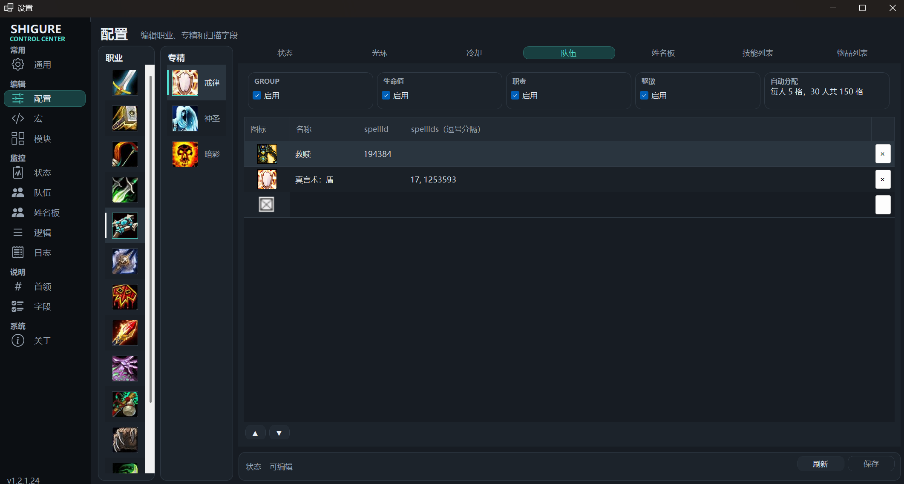

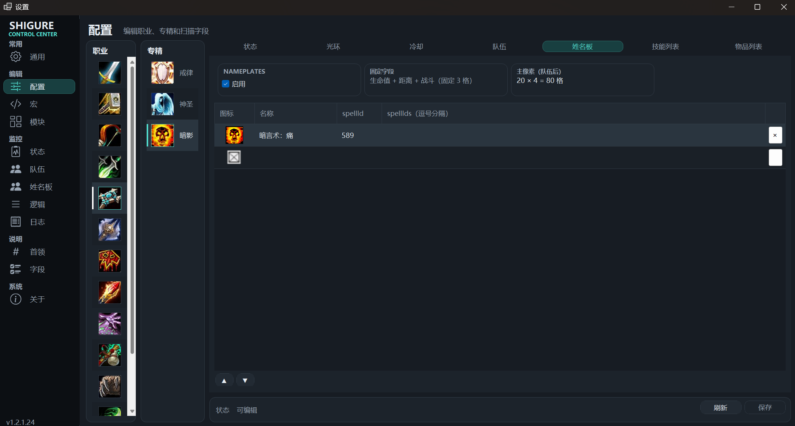

## 9. 运行状态与排错

- “状态”页：查看基础状态、光环、技能、物品和动态字段。
- “队伍”页：查看队伍成员与扫描结果。
- “逻辑”页：查看命中的模块、目标、按键和调试值。
- “日志”页：查看启动、同步、匹配、执行和异常信息。

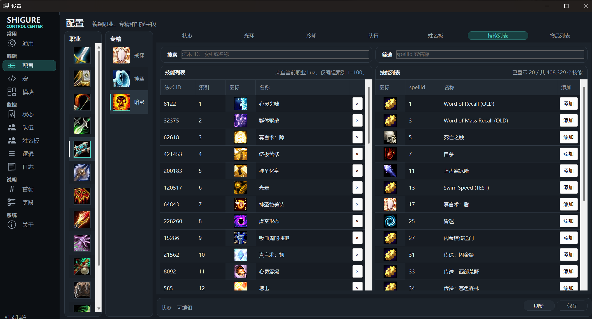

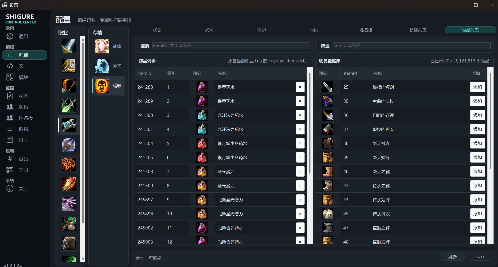

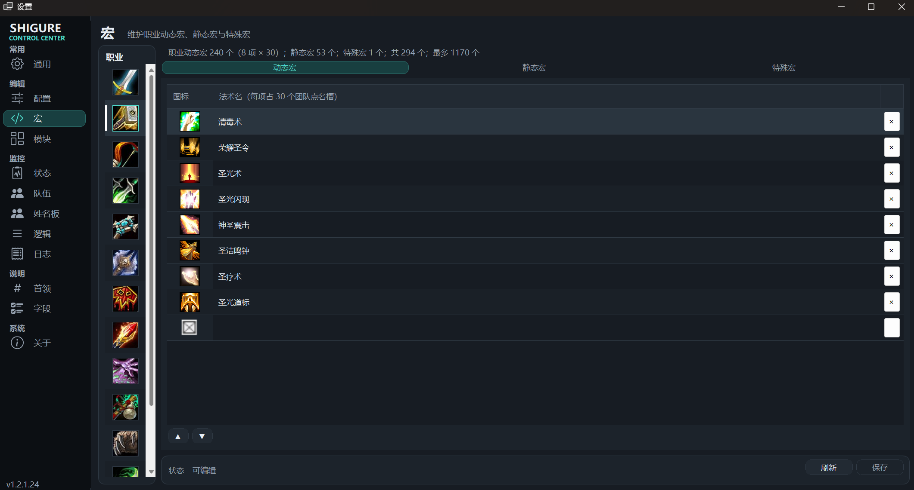

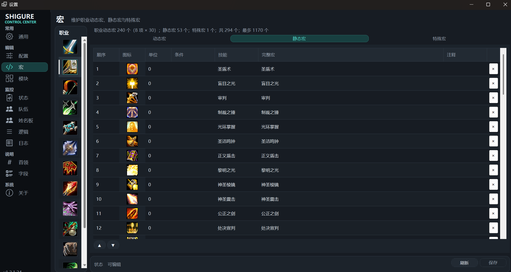

如果没有识别到职业或专精，请先检查游戏窗口是否可见、`wow_process.txt` 是否正确，以及是否完成“更新配置”。如果识别正常但没有按键，检查模块是否启用、匹配条件是否过窄，以及 keymap 是否包含对应技能。

## 10. 数据位置

- 插件源码：程序目录 `Fuyutsui/`
- 运行时配置：程序目录 `config/`
- 按键映射：程序目录 `keymap/`
- 模块：`我的文档/Shigure/module/`
- 界面缓存：`我的文档/Shigure/cache/`
- 技能/物品图标包：程序目录 `data/SpellIcons.shgpack`

模块文件以模块名命名，请避免重名。修改配置或宏后应通过设置页保存，让程序自动完成转换和同步，不要直接编辑生成的 JSON。

## 11. 构建

```powershell
dotnet build .\Shigure.csproj
```

构建成功且无警告/错误即可完成基础验证。详细的模块字段、配置格式和命令行参数请参阅仓库根目录的 [README.md](../README.md)。

## 免责声明

Shigure 仅供技术研究、学习交流和个人实验使用。用户须自行确认使用行为符合适用法律、目标软件及服务条款；因使用软件产生的账号、数据或其他损失由用户自行承担。

## 12. 界面速览

以下截图展示其余设置页和编辑器页面：

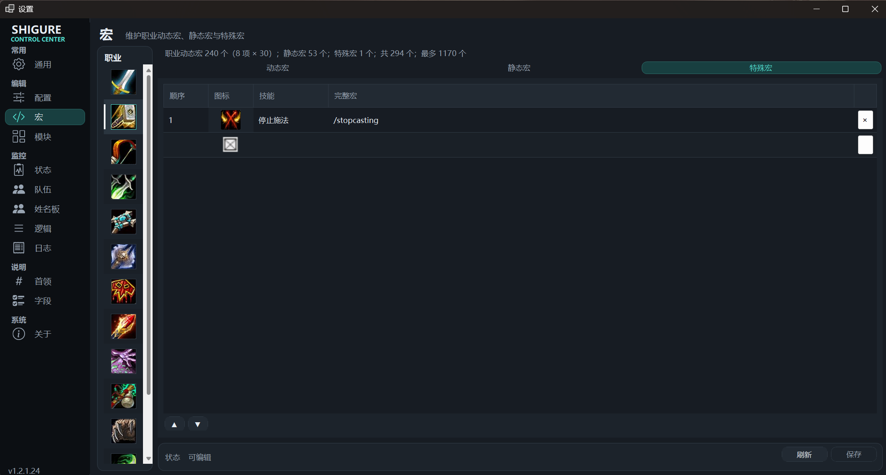
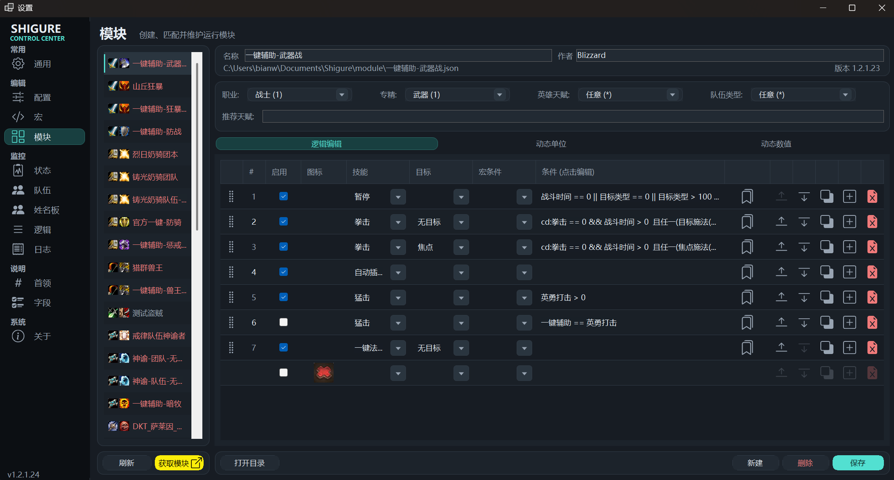
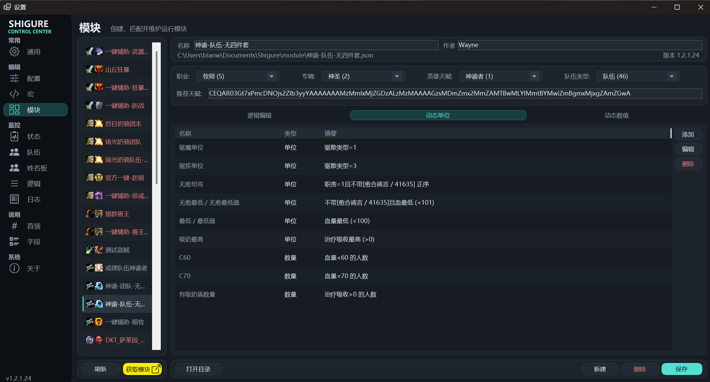
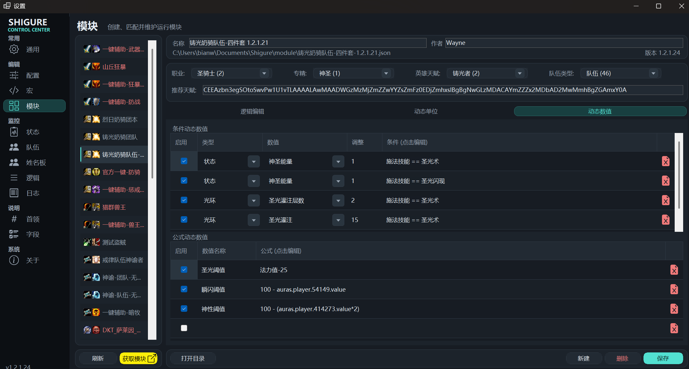
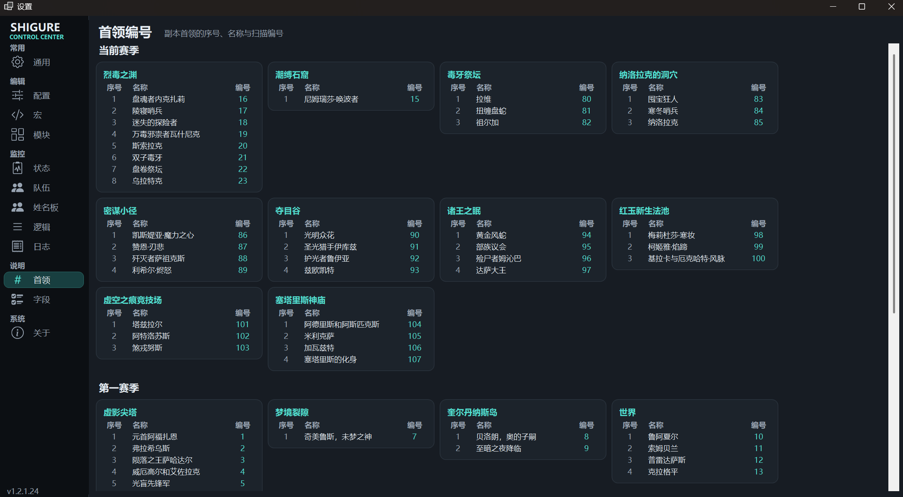
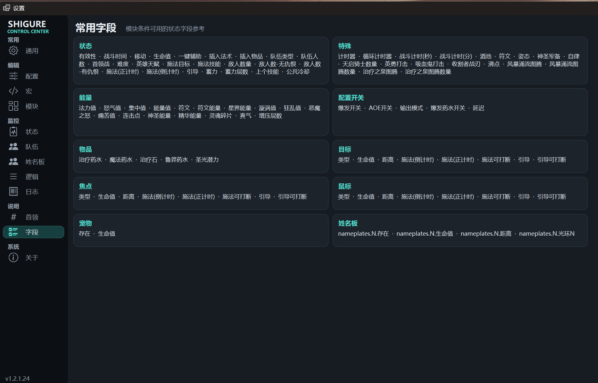

